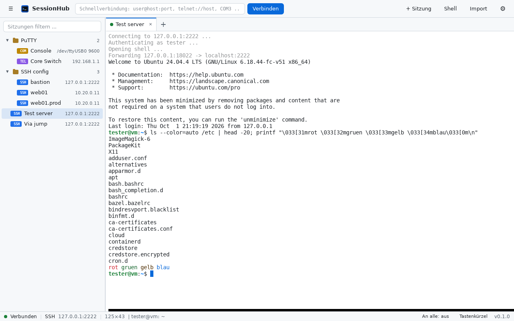
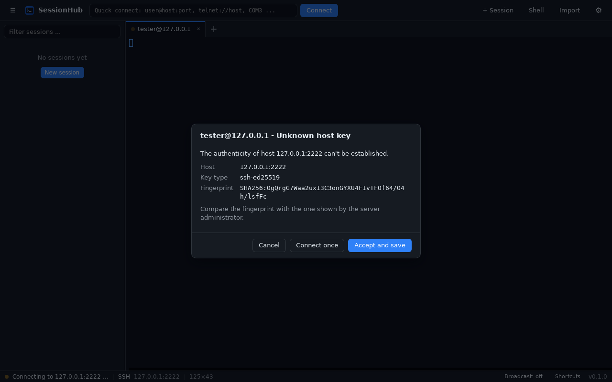

# SessionHub

Ein schneller, stabiler Terminal- und Sitzungsmanager für **Linux** und **Windows** –
gedacht als moderner Ersatz für PuTTY und mRemoteNG.


## Funktionen

**Protokolle**

- **SSH** mit eigenem, reinem Rust-Stack (`russh`). Es wird kein OpenSSL und kein `ssh`-Binary benötigt.
  - Anmeldung per Schlüsseldatei (OpenSSH-Format, auch passwortgeschützt), SSH-Agent
    (ssh-agent, gpg-agent, KeePassXC; unter Windows OpenSSH-Agent oder Pageant), Standard-Schlüssel
    (`~/.ssh/id_ed25519`, `id_ecdsa`, `id_rsa`), Passwort und keyboard-interactive (2FA/OTP)
  - **Jump-Hosts / ProxyJump**, auch über mehrere Stufen
  - **Lokale Portweiterleitungen** (`-L`)
  - Host-Key-Prüfung gegen `~/.ssh/known_hosts` (kompatibel mit OpenSSH, auch gehashte Einträge),
    deutliche Warnung bei geänderten Schlüsseln
  - Keepalive, Komprimierung, Befehl auf dem Server statt Shell
- **Telnet** mit sauberer Optionsaushandlung (Fenstergröße, Terminaltyp, Echo …) und **Raw TCP**
- **Seriell** (USB-Seriell-Adapter, RS-232) mit Baudrate, Datenbits, Parität, Stoppbits und Flusskontrolle
- **Lokale Shell** (bash/zsh/fish …; unter Windows PowerShell, cmd, WSL, Git Bash)
- **RDP / VNC** über installierte Clients (FreeRDP/Remmina/TigerVNC, unter Windows `mstsc`)

**Oberfläche**

- Sitzungsbaum mit Ordnern, Drag & Drop, Filter, Tastaturbedienung und Kontextmenüs
- Tabs (verschiebbar, einfärbbar), Schnellverbindung (`user@host:port`, `telnet://host`, `COM3`, `/dev/ttyUSB0 9600`)
- Terminal auf Basis von xterm.js (wie in VS Code): Truecolor, Unicode, Links, Suche, GPU-Rendering mit automatischem Fallback
- PuTTY-Komfort: Markieren kopiert, Rechtsklick fügt ein, Mittelklick fügt ein (Linux)
- **Eingabe an alle Tabs** (Broadcast), Neuverbinden mit Enter, optional automatisches Neuverbinden
- Sitzungsprotokoll in eine Datei
- Helles/dunkles Design, Deutsch und Englisch

**Daten & Sicherheit**

- Passwörter und Passphrasen liegen **nur im System-Schlüsselbund** (Secret Service: GNOME Keyring,
  KWallet, KeePassXC …; unter Windows die Anmeldeinformationsverwaltung), niemals in der Sitzungsdatei
- Sitzungen werden atomar gespeichert (temporäre Datei + `fsync` + Umbenennen) und als `.bak` gesichert;
  eine beschädigte Datei wird automatisch aus der Sicherung wiederhergestellt
- **Import** aus mRemoteNG (`confCons.xml`), PuTTY und `~/.ssh/config`; Export/Import als JSON
- **Portabler Modus**: Liegt neben der Programmdatei (oder neben dem AppImage) ein Ordner
  `sessionhub-data`, werden alle Einstellungen dort gespeichert

<p>
  
  
</p>

## Installation

Fertige Pakete entstehen über GitHub Actions, sobald ein Tag `v*` gepusht wird (siehe *Releases*).

| System | Paket |
|---|---|
| Alle Linux-Distributionen | `SessionHub_*.AppImage` (ausführbar machen und starten) |
| Debian, Ubuntu, Mint, Pop!_OS | `sessionhub_*.deb` |
| Fedora, openSUSE | `sessionhub-*.rpm` |
| Windows 10/11 | `SessionHub_*-setup.exe` oder `.msi` |

**Voraussetzungen unter Linux:** WebKitGTK 4.1 (enthalten ab Ubuntu 22.04, Debian 12, Fedora 37,
openSUSE Leap 15.5, Arch, Manjaro, Linux Mint 21). Für gespeicherte Passwörter wird ein
Secret-Service-Dienst benötigt; GNOME und KDE bringen ihn mit, bei schlanken Desktops
(i3, Sway …) `gnome-keyring` oder KeePassXC mit aktivierter Secret-Service-Integration installieren.

**Serielle Ports unter Linux:** Der Benutzer muss in der Gruppe `dialout` (Debian/Ubuntu/Fedora) bzw.
`uucp` (Arch) sein: `sudo usermod -aG dialout $USER`, danach neu anmelden.

**RDP/VNC:** z. B. `sudo apt install freerdp3-x11 tigervnc-viewer` oder Remmina. Eigene Befehle lassen sich
in den Einstellungen hinterlegen (Platzhalter `{host}`, `{port}`, `{user}`, `{args}`).

## Tastenkürzel

| Kürzel | Aktion |
|---|---|
| `Strg+Umschalt+K` | Schnellverbindung |
| `Strg+Umschalt+N` | Neue Sitzung |
| `Strg+Umschalt+T` | Neue lokale Shell |
| `Strg+Umschalt+W` | Tab schließen |
| `Strg+Tab`, `Strg+Bild↓/↑` | Nächster/vorheriger Tab |
| `Alt+1` … `Alt+9` | Zu Tab wechseln |
| `Strg+Umschalt+C` / `V` | Kopieren / Einfügen (auch `Strg+Einfg` / `Umschalt+Einfg`) |
| `Strg+Umschalt+F` | Im Terminal suchen |
| `Strg+Umschalt+D` | Sitzung duplizieren |
| `Strg+Umschalt+E` | Sitzungen filtern |
| `Strg+Umschalt+B` | Seitenleiste ein/aus |
| `Strg +` / `Strg -` / `Strg 0` | Schriftgröße |
| `F2` / `Entf` | Ausgewählte Sitzung bearbeiten / löschen |

## Selbst bauen

Benötigt: Rust (stabil, ≥ 1.89), Node.js ≥ 20.

```bash
# Debian/Ubuntu – Build-Abhängigkeiten
sudo apt install libwebkit2gtk-4.1-dev libayatana-appindicator3-dev librsvg2-dev build-essential
# Fedora:  sudo dnf install webkit2gtk4.1-devel libappindicator-gtk3-devel librsvg2-devel
# Arch:    sudo pacman -S webkit2gtk-4.1 libappindicator-gtk3 librsvg base-devel

npm ci
npm run tauri dev                         # Entwicklungsmodus mit Hot-Reload
npm run tauri build                       # Release-Pakete für das aktuelle System
npm run tauri build -- --bundles appimage # nur AppImage
```

Tests und Prüfungen:

```bash
npm run build                         # TypeScript-Prüfung + Frontend-Build
cd src-tauri && cargo test            # Unit-Tests (Telnet, known_hosts, Importer, Speicherung …)
cd src-tauri && cargo clippy --all-targets -- -D warnings
```

## Architektur

```
src/                  Oberfläche (TypeScript, ohne Framework)
  main.ts             Layout, Schnellverbindung, Tastenkürzel
  tree.ts             Sitzungsbaum
  tabs.ts, terminal.ts  Tabs, xterm.js, Verbindungslebenszyklus
  dialogs.ts, prompts.ts  Sitzungseditor, Einstellungen, Import, Host-Key/Passwort-Abfragen
  i18n.ts             Deutsch/Englisch
src-tauri/src/        Backend (Rust)
  conn/               ssh.rs, telnet.rs, serial.rs, local.rs, known_hosts.rs
  store.rs            Konfigurationsverzeichnis, atomare JSON-Speicherung
  secrets.rs          System-Schlüsselbund
  importers.rs        mRemoteNG, PuTTY, OpenSSH-Config, JSON
  external.rs         RDP/VNC-Clients starten
```

Jede Verbindung läuft als eigener Task im Backend. Terminalausgaben gelangen als Binärdaten über einen
Tauri-IPC-Kanal ins Frontend, ohne JSON- oder Base64-Umweg. Eingaben laufen über eine eigene Warteschlange.
Ein langsamer Server blockiert deshalb nie die Ausgabe oder die Oberfläche.

Konfiguration: `~/.config/sessionhub/` (Linux) bzw. `%APPDATA%\SessionHub\sessionhub\config\` (Windows).

## Geplant

- SFTP-Dateibrowser
- Geteilte Ansicht (Split-Panes)
- Remote- und dynamische Portweiterleitung (`-R`, `-D`/SOCKS), X11- und Agent-Weiterleitung
- Verschlüsselter Passwort-Tresor als Alternative, wenn kein Secret Service vorhanden ist
- PuTTY-Schlüssel (`.ppk`) direkt laden
- Flatpak-Paket, ARM64-Builds
- Befehls-Snippets/Makros
